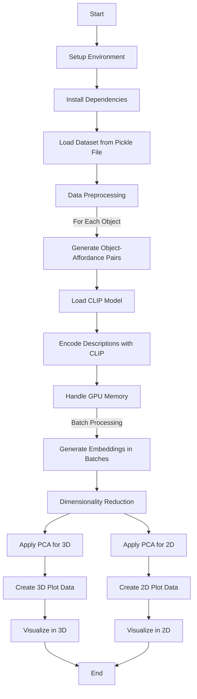

# 3D Affordance Visualization

This repository contains the code for visualizing 3D affordances of various objects using CLIP embeddings and dimensionality reduction techniques. The goal is to explore whether different objects with the same affordances are clustered together in a reduced-dimensional space, which could imply a shared underlying structure for those affordances.

## Dataset
```
https://andlollipopde.github.io/3D-AffordanceNet/
```
### Implimentation & Benchmark
```
https://github.com/Gorilla-Lab-SCUT/AffordanceNet
```

## Setup

To run this code, you will need to have access to a Google Colab environment with a GPU runtime. Follow these steps to set up your environment:

1. Upload the `full_shape_val_data.pkl` dataset to your Google Drive or Colab's local environment.
2. Open the `Affordance_Visualization.ipynb` notebook in Google Colab.
3. Ensure that the notebook's runtime is set to GPU (You can set this in the 'Runtime' menu under 'Change runtime type').

## Usage

The notebook is divided into several cells, each responsible for a part of the process:

1. **Loading the Dataset**: The dataset is loaded from a pickle file.
2. **Data Preprocessing**: Object-affordance pairs are generated from the dataset.
3. **Embedding Generation**: CLIP is used to encode these pairs into embeddings.
4. **Dimensionality Reduction**: PCA is applied to reduce the embeddings to a lower-dimensional space (2D and 3D).
5. **Visualization**: Interactive plots are generated to visualize the results.

Run each cell in the notebook sequentially. The final output will be interactive 2D and 3D plots displaying the affordances.

## Flowchart

Here's a flowchart describing the process:


