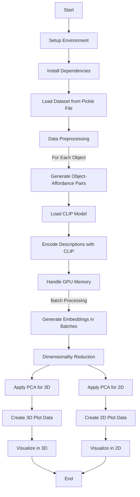

```mermaid
flowchart TB
    A[Start] --> B[Setup Environment]
    B --> C[Install Dependencies]
    C --> D[Load Dataset from Pickle File]
    D --> E[Data Preprocessing]
    E -->|For Each Object| F[Generate Object-Affordance Pairs]
    F --> G[Load CLIP Model]
    G --> H[Encode Descriptions with CLIP]
    H --> I[Handle GPU Memory]
    I -->|Batch Processing| J[Generate Embeddings in Batches]
    J --> K[Dimensionality Reduction]
    K --> L[Apply PCA for 3D]
    K --> M[Apply PCA for 2D]
    L --> N[Create 3D Plot Data]
    M --> O[Create 2D Plot Data]
    N --> P[Visualize in 3D]
    O --> Q[Visualize in 2D]
    P --> R[End]
    Q --> R

```
